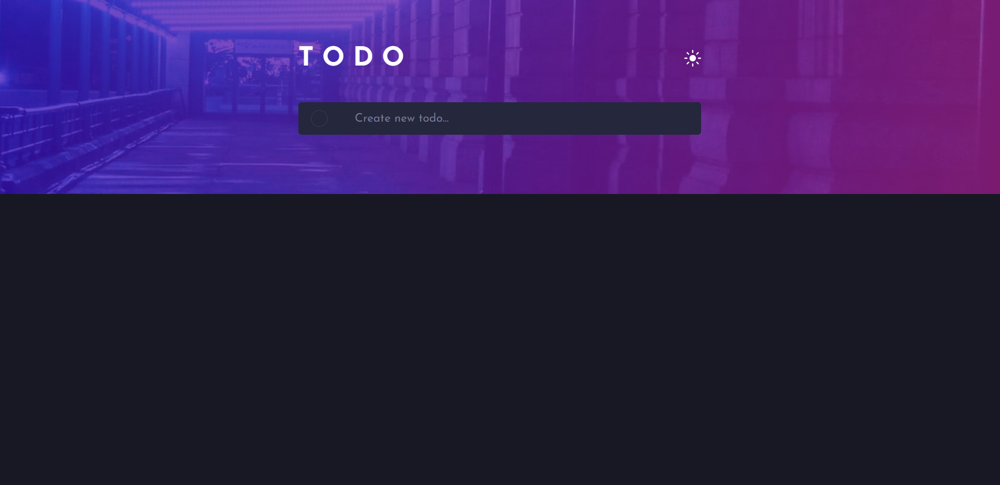
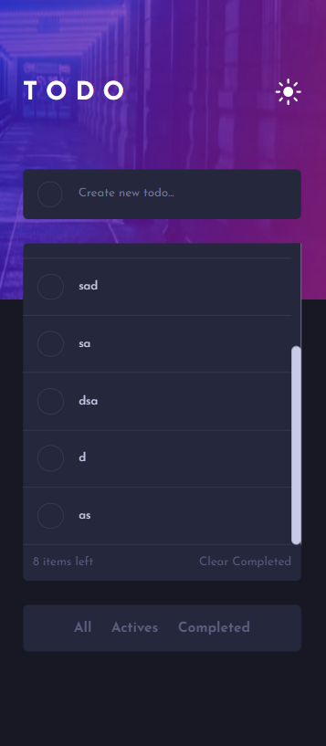

# todo-application

## Overview

### The challenge

Users should be able to:

- View the optimal layout for the app depending on their device's screen size
- See hover states for all interactive elements on the page
- Add new todos to the list
- Mark todos as complete
- Delete todos from the list
- Filter by all/active/complete todos
- Clear all completed todos
- Toggle light and dark mode

### Screenshot

### Links

- Solution URL: [Github Repository](https://github.com/batonitamazi/todo-application)
- Live Site URL: [Live app](https://todo-app-batonitamazi.netlify.app/)

## My process

### Built with

- Semantic HTML5 markup
- CSS custom properties
- Flexbox
- Mobile-first workflow
- [React](https://reactjs.org/) - JS library

### What I learned
Css variables, themeContext responsive design and conditional rendering

## Author

- Linkedin - [Tamazi mirianashvili](https://www.linkedin.com/in/tamazi-mirianashvili-735600210/)
- Github - [@batonitamazi](https://github.com/batonitamazi)